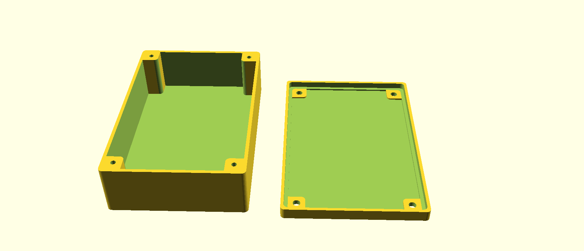

# About

*3D-FlexCase* is a customizable OpenSCAD library for simple creation of electronic component housings / enclosures, 
such as your own PCBs, Arduino, Raspberry Pi, ESP6288, ESP32, etc.

The idea is to parameterize the basic housing and then add your specific extensions such as brackets, lead-throughs, etc.

# Requirements

## BOSL Library

This project uses the [BOSL library](https://github.com/revarbat/BOSL). Please install this as described [here](https://github.com/revarbat/BOSL#installation).

## Screws

Recommendation for screws to fix the cover on the tray:

- 4mm x 20mm flathead Spax, or
- 4mm x 25mm flathead Spax

## Installation

1. Download the .zip and extract
2. Rename directory `3d-flexcase-master` to `3d-flexcase`
3. Copy directory `3d-flexcase` to the [OpenSCAD library folder](https://en.wikibooks.org/wiki/OpenSCAD_User_Manual/Libraries) of your system
4. Restart OpenSCAD

# Usage

A simple example how to use *3D-FlexCase* in your OpenSCAD project:

```
use <3d-flexcase/FlexCase-Housing.scad>

$fn = 40;

//Customize parameters
enclosureWidth = 80;
enclusureLength = 120;
enclusureHeightTray = 30;
enclusureHeightCover = 3;
hullThickness = 2;
cornerRadius = 2;
screwDiameter = 4;

// The cover of the housing:
translate([enclosureWidth / 2 + 10, 0, enclusureHeightCover/2]) cover(enclosureWidth, enclusureLength, enclusureHeightCover, hullThickness, cornerRadius, screwDiameter);

// The tray of the housing:
translate([-enclosureWidth / 2 -10, 0, enclusureHeightTray/2]) tray(enclosureWidth, enclusureLength, enclusureHeightTray, hullThickness, cornerRadius, screwDiameter);
```

... will result in:



You might then want to extend, change the housing, e.g. by 
- adding mounts / brackets for PCBs
- adding cable or LED lead-throughs
- etc.


